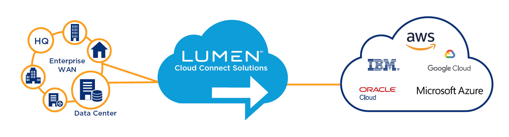

{{{
  "title": "Lumen Cloud Connect Services Introduction",
  "date": "05-18-2021",
  "author": "Gavin Lai",
  "attachments": [
  {
    "file_name": "Sample CloudFormation template to create VPC with VPN connectivity",
    "url": "../attachments/vpn-vpc-cloudforamtion.zip",
    "type": "application/zip"
  }
  ],
  "contentIsHTML": false,
  "sticky": true
}}}

### In this article:

* [Overview](#overview)
* [Audience](#audience)
* [Prerequistes](#prerequistes)
* [Lumen Cloud Connect Capabilities and Flexibility](#lumen-cloudconnect-capabilities-flexibility)
* [Cloud Providers supported by Lumen Cloud Connect](#cloud-providers-supported-by-lumne-cloud-cloudconnect)
* [Lumen Cloud Connect Connectivity Options](#lumen-cloud-connect-connectivity-options)
* [Procedure to Configure Lumen Cloud Connect](#procedure-to-configure-lumen-cloud-connect)
* [Support](#support)

### Overview
Lumen Cloud Connect Solutions delivers secure, high-performance and virtualized networking functionality to leading public and private clouds. Our global reach and extensive Wavelength, Carrier Ethernet and IP VPN connectivity options meet today’s hybrid cloud business requirements. And available, dynamic SDN-based controls can provide you with a network experience that matches your cloud experience.

### Audience

All users intertest in connecting to any public cloud platform

### Prerequistes

None

### CloudConnect Capabilities and Flexibility
* Capabilities
  * Global Reach - Cloud connections in the North American, European, Latin American and Asia-Pacific regions
  * Connectivity - Extensive connectivity options including Wavelengths, Ethernet Services and IP VPN, globally for most major CSPs
  * Visibility - Available portals, mobile applications and APIs for accessibility to data, metrics and SDN network controls
  * Data Center Connectivity - 360+ Lumen data centers, 2,200 third-party data centers
* Flexibility
  * Dynamic SDN-based capabilities are layered onto network services to provide greater visibility, flexibility and control of application traffic traversing your metro or wide-area network

### Cloud Providers supported by Lumen Cloud Connect

* Amazon Web Services® Direct Connect
* Microsoft® ExpressRoute
* Google® Cloud Partner Interconnect
* Google® Cloud Carrier Peering
* IBM® Resiliency Services
* IBM® Cloud Managed Services
* IBM® Cloud Direct Link
* Oracle® Cloud Infrastructure FastConnect

For providers not listed above, please contact your Lumen sales representative with your destinations.

### Lumen Cloud Connect Connectivity Options
**Cloud Provider/Connection Type**|**AWS**|**Azure**|**GCP**|**Oracle**|IBM Cloud**|**IBM Resiliency Services and Cloud Managed Services**
-------------|-------------|-------------|-------------|-------------|-------------|-------------
Layer 1 (WaveLength)|X|X|X|X|X|
Layer 2 (Ethernet)|X|X|X|X| |X
Layer 3 (MPLS/IP VPN)|X|X| | |X|X

More options can be available by contacting your Lumen sales representative.

Placeholder for overview pages for each of the cloud providers
* AWS
* Azure
* GCP
* Oracle
* IBM

### Procedure to Configure Lumen Cloud Connect

For new Lumen Cloud Connect users, please refer to [product readiness page](())

### Custom configurations
Customers who require custom configuration can leverage our [service task](//www.lumen.com/help/en-us/readiness/products.html). Examples include:
* [EVPL to Microsoft Azure](//www.lumen.com/content/dam/lumen/help/readiness/evpl-to-microsoft-azure.pdf)
* [MPLS/IPVPN to AWS with Dedicated Cross Connect](//www.lumen.com/content/dam/lumen/help/readiness/mpls-ipvpn-to-aws-with-dedicated-cross-connect.pdf)

### Support

* For issues related to Lumen Cloud Connect Services, please open a Lumen Support ticket by visiting [customer support](//www.lumen.com/en-us/contact-us-support.html) or [through the Lumen Support website](//www.lumen.com/help/en-us/home.html).
