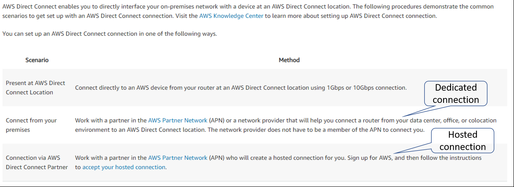
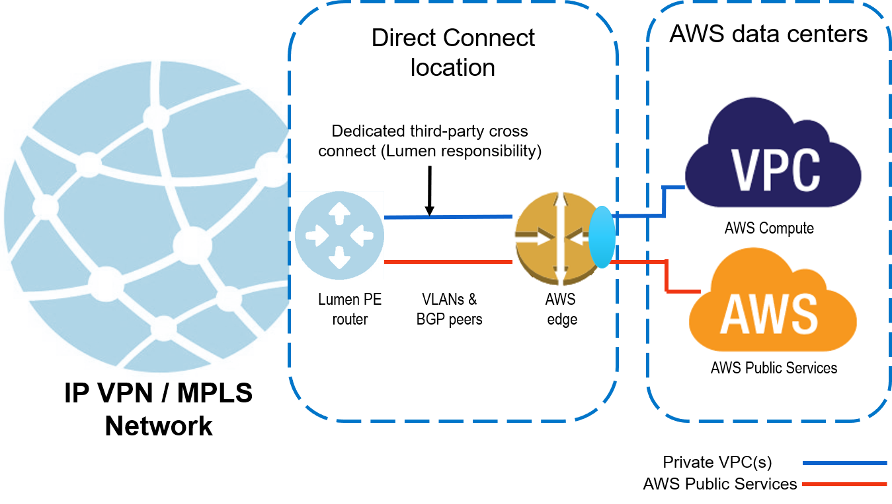
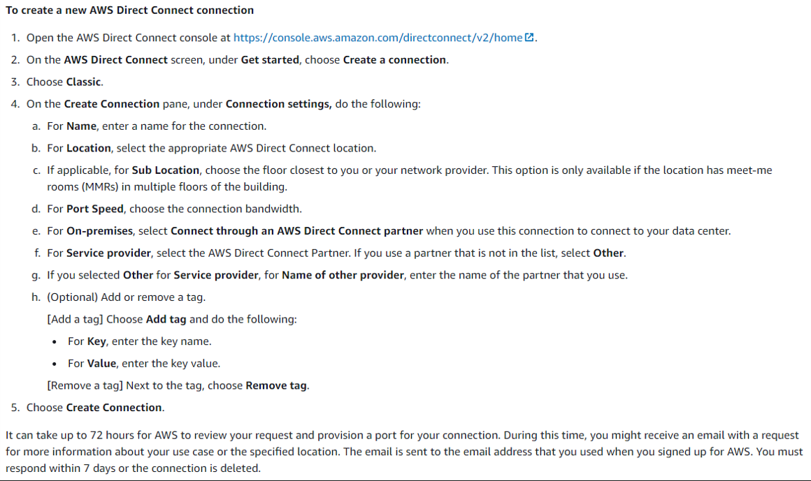
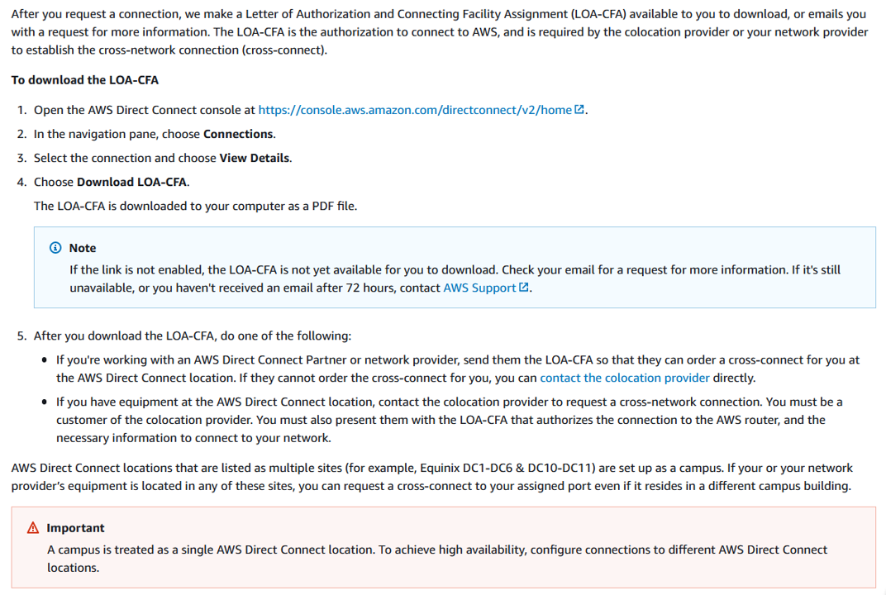

{{{
  "title": "Lumen Cloud Connect MPLS/IPVPN to AWS with dedicated cross connect",
  "date": "06-06-2021",
  "author": "Gavin Lai",
  "attachments": [
  {
    "file_name": "Sample CloudFormation template to create VPC with VPN connectivity",
    "url": "../attachments/vpn-vpc-cloudforamtion.zip",
    "type": "application/zip"
  }
  ],
  "contentIsHTML": false,
  "sticky": true
}}}

### In this article:

* [Overview](#overview)
* [Audience](#audience)
* [Prerequisites](#prerequisites)
* [What is Direct Connect](#what-is-direct-connect)
* [Lumen Cloud Connect MPLS IPVPN to AWS](#lumen-cloud-connect-mpls-ipvpn-to-aws)
* [Lumen Cloud Connect Roles and Responsibilities](#lumen-cloud-connect-roles-responsibilities)
* [Overview of procedures to configure Lumen Cloud Connect](#overview-of-procedures-to-configure-lumen-cloud-connect)
  * [Customer requests Lumen Cloud Connect service](#customer-requests-lumen-cloud-connect-service)
  * [Creating the Direct Connect and Generating LOA CFA](#creating-the-direct-connect-and-generating-loa-cfa)
  * [Creating the AWS Direct Connect from the AWS User Console](#creating-the-aws-direct-connect-from-the-aws-user-console)
  * [Obtaining LOA CFA from the AWS User Console](#obtaining-loa-cfa-from-the-aws-user-console)
  * [Lumen and Customer Provisions Cloud Connect to AWS](#lumen-and-customer-provisions-cloud-connect-to-aws)
* [Additional AWS Direct Connect and Lumen Cloud Connect Resources](#additional-aws-direct-connect-and-lumen-cloud-connect-resources)
* [Support](#support)

### Overview
The purpose of this document is to provide an end-to-end walk through for a customer setting up Hosted Direct Connect for the first time via CenturyLink’s Cloud Connect. Information contained is provided to serve as a supplement to AWS documentation linked throughout this document. Users should check the provided links to obtain the most up-to-date information and for more details pertaining to AWS processes.  This document is for Cloud Connect services connecting to AWS Direct Connect with a dedicated cross connect (see diagram below).  The supporting service ordered from Lumen is dedicated cloud connect to AWS.  

### Audience

Users has ordered [Lumen Cloud Connect](lumen-cloud-connect-introduction.md) to connect to their AWS environment.

### Prerequistes

Lumen Cloud Connect is ordered and access to AWS Portal with the right permission

### What is Direct Connect

Please refer to [What is AWS Direct Connect knowledge article](lumen-cloud-connect-what-is-directconnect.md).  

### Lumen Cloud Connect MPLS IPVPN to AWS

* Customer is responsible for Direct Connect costs and configuration
* Any NAT configuration that is required due to the use of any AWS Public Services will be the responsibility of the customer.

### Lumen Cloud Connect Roles and Responsibilities

**Steps required to set up AWS Direct Connect Connectivity**|**End Customer**|**Lumen**|**AWS**
-------------|-------------|-------------|-------------
**Set up connectivity to AWS Direct Connect location**| | |
Order Lumen Dedicated Cloud Connect service(s) to AWS Direct Connect|X| |
Provide the LOA/CFA to your Lumen representative|X| |
Create the virtual circuit to AWS| |X|
Monitor the virtual circuit to AWS| |X|
**Set up BGP peering between Lumen provided edge and AWS edge device**| | |
Configure BGP peering on Lumen PE router facing AWS| |X|
Configure BGP peering on AWS side using console facing Lumen|X| |
**Link services on AWS to the dedicated circuit**| | |
Create and link virtual interface, virtual private gateway, VPC, Direct Connect gateway, etc. as applicable using the AWS console|X| |

### Overview of procedures to configure Lumen Cloud Connect

1. [Customer requests Lumen Cloud Connect service](#customer-requests-lumen-cloud-connect-service)
2. [Creating the Direct Connect and Generating LOA CFA](#creating-the-direct-connect-and-generating-loa-cfa)
3. [Creating the AWS Direct Connect from the AWS User Console](#creating-the-aws-direct-connect-from-the-aws-user-console)
4. [Obtaining LOA CFA from the AWS User Console](#obtaining-loa-cfa-from-the-aws-user-console)
5. [Lumen and Customer Provisions Cloud Connect to AWS](#lumen-and-customer-provisions-cloud-connect-to-aws)

### Procedure to Configure Lumen Cloud Connect

#### Customer requests Lumen Cloud Connect service
  * To order Lumen Cloud Connect to AWS Direct Connect, contact your Lumen Account Representative
  * Information needed by CenturyLink to complete the connection:
    * AWS service(s) you are connecting to
    * Public Virtual Interface (VIF) Requirements
    * VPC / VIF / Direct Connect Gateway Requirements
      * Identify how many VPCs/VIFs etc you need connectivity to
        * Each VPC/VIF requires a separate logical connection with Dedicated Cloud Connect IPVPN/MPLS from Lumen
    * Determine the amount of bandwidth needed to each VPC/VIF
  * Which AWS Region and/or Direct Connect location do you require connectivity to
  * What contractual term length is desired (1yr, 3yr, 5yr etc)
  * Confirm you will be providing LOA/CFA to Lumen for connection at the Direct Connect location.

#### Creating the Direct Connect and Generating LOA/CFA
For latest information, please refer to [AWS Direct Connect User Guide](//docs.aws.amazon.com/directconnect/latest/UserGuide/getting_started.html)
  * For Dedicated Cloud Connect to AWS Direct Connect service, you will need to obtain LOA/CFA from AWS via your AWS user console. To do this you first need to create an AWS Direct Connect, then select the appropriate Direct Connect Location, which will then generate an LOA/CFA.  
  * Once you obtain the LOA/CFA document, please provide it to your Lumen account team immediately. This is required for the Lumen account team to submit your order for services to be provisioned.
  * Before you create the Direct Connect via the AWS user console, please ensure you have the following information:
    * The port speed that you require. You cannot change the port speed after you've created the connection request. This port speed will match that of the Lumen Cloud Connect port speed (either 1Gb or 10Gb).
    * The AWS Direct Connect location at which the connection is to be terminated.  If you are not sure what these are, please consult with your Lumen representative.
    * To complete the above steps, please see instructions from the AWS website continued on the next 2 steps.

#### Creating the AWS Direct Connect from the AWS User Console
Depending on the resiliency options, the process can be different, the detail can be found in [AWS Direct Connect User Guide](//docs.aws.amazon.com/directconnect/latest/UserGuide/getting_started.html).

#### Obtaining LOA/CFA from the AWS User Console
For latest information, please refer to [AWS Direct Connect User Guide](//docs.aws.amazon.com/directconnect/latest/UserGuide/getting_started.html#DedicatedConnection)

### Lumen and Customer Provisions Cloud Connect to AWS
* Upon network order submission, Lumen will provision a Layer 3 IPVPN/MPLS connection to the requested interconnect point
  * Lumen  will configure VLAN Tagging and Layer 3 BGP Routing on the Lumen PE Router(s).
* Lumen completes configuration, and provides Customer with necessary information that you will need to configure the Layer 3 turn up on the AWS side via the AWS user console:
  * IP subnet(s)
  * Autonomous System Number (ASN) info for BGP peering
  * BGP Authorization Key
  * VLAN ID

Upon provisioning completion by CenturyLink, you will receive the configuration information from the CenturyLink provisioning with instructions as to order completion, activation scheduling, etc.. As applicable to your order.

### Additional AWS Direct Connect and Lumen Cloud Connect Resources
Please refer to the [What is AWS Direct Connect Knowledge Article](lumen-cloud-connect-what-is-directconnect.md) for [additional Azure ExpressRoute resources](lumen-cloud-connect-what-is-directconnect.md#aws-direct-connection-resources).
For further information on Lumen Cloud Connect, please refer to [product readiness page](//www.lumen.com/help/en-us/readiness/products.html)

### Support

* For issues related to Lumen Cloud Connect Services, please open a Lumen Support ticket by visiting [customer support](//www.lumen.com/en-us/contact-us-support.html) or [through the Lumen Support website](//www.lumen.com/help/en-us/home.html).
