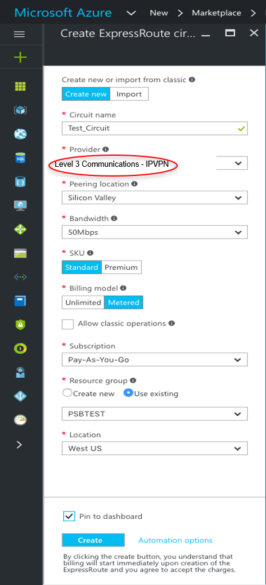
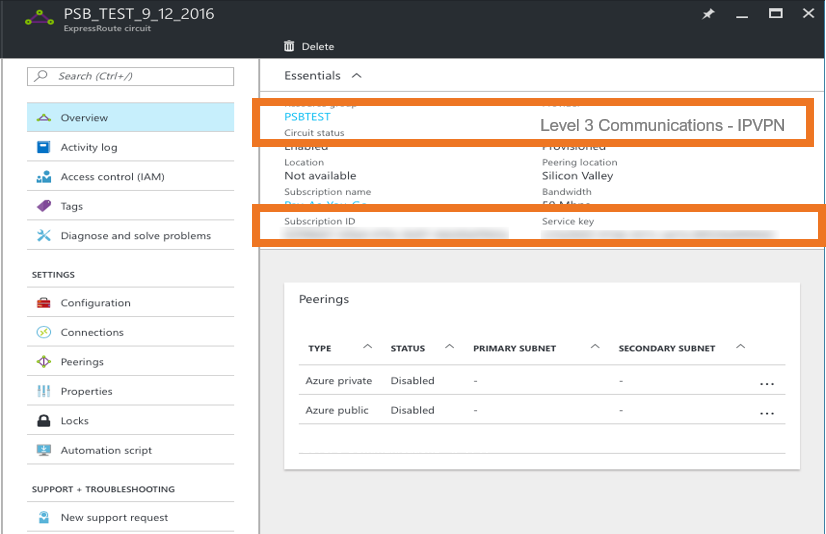

{{{
  "title": "Lumen Cloud Connect MPLS/IPVPN to Microsoft Azurevia Azure portal Azure Resource Manager",
  "date": "06-06-2021",
  "author": "Gavin Lai",
  "attachments": [
  {
    "file_name": "Sample CloudFormation template to create VPC with VPN connectivity",
    "url": "../attachments/vpn-vpc-cloudforamtion.zip",
    "type": "application/zip"
  }
  ],
  "contentIsHTML": false,
  "sticky": true
}}}

### In this article:

* [Overview](#overview)
* [Audience](#audience)
* [Prerequistes](#prerequistes)
* [Lumen Cloud Connect Capabilities and Flexibility](#lumen-cloudconnect-capabilities-flexibility)
* [Cloud Providers supported by Lumen Cloud Connect](#cloud-providers-supported-by-lumne-cloud-cloudconnect)
* [Lumen Cloud Connect Connectivity Options](#lumen-cloud-connect-connectivity-options)
* [Procedure to Configure Lumen Cloud Connect](#procedure-to-configure-lumen-cloud-connect)
* [Support](#support)

### Overview
The purpose of this document is to provide an end-to-end walk through for a customer setting up ExpressRoute for the first time via Lumen’s Cloud Connect. Information contained is provided to serve as a supplement to Microsoft documentation linked throughout this document. Users should check the provided links to obtain the most up-to-date information and for more details pertaining to Microsoft processes.

### Audience

Users has ordered [Lumen Cloud Connect](../Cloud Connect/lumen-cloud-connect-introduction.md) to connect to their Azure environment.

### Prerequistes

Lumen Cloud Connect is ordered and access to Azure Portal with the right permission

### What is ExpressRoute
Please refer to [What is ExpressRoute knowledge article](../Cloud Connect/lumen-cloud-connect-what-is-expressroute.md).  

### Lumen Cloud Connect MPLS/IPVPN to Microsoft Azure

* Customer is responsible for express route costs and configuration
* Firewall / NAT services will be provided by Lumen when accessing Microsoft Peering for PaaS/SaaS Services

### Lumen Cloud Connect Roles and Responsibilities

**Steps required to set up Azure ExpressRoute connectivity**|**End Customer**|**Lumen**|**Microsoft Azure (Automated via portal)**
-------------|-------------|-------------|-------------
**Set up physical connectivity to Azure ExpressRoute location**| | |
Decide on the type of BGP peering required (Azure Private Peering-IaaS or Microsoft Peering-PaaS/SaaS)|X| |
Order Layer 3 (MPLS) Cloud Connect service to Azure ExpressRoute location from Lumen Account Team|X| |
Order MSFT Azure ExpressRoute connection via MSFT Azure Portal, using “Level 3 Communications – IPVPN” as the Service Provider name, with the appropriate bandwidth and location.  *see your Cloud Connect Solutions Architect for more details or direction. More options can be available by contacting your Lumen sales representative.|X| |
Provision Layer 3 (MPLS) Service device with BGP, connecting to MSFT Azure ExpressRoute| |X|
Provision ExpressRoute circuit and provide the ExpressRoute Service Key to Lumen| | |X
**Set up BGP peering between Lumen provided customer edge and Azure edge device**| | |
Configure BGP Peering on Lumen PE Routers| |X|
Configure BGP Peering on Azure side| |X|
Configure BGP Route Filtering (:warning: required for Microsoft Peering PaaS/SaaS)|X| |
**Link services on Azure to the dedicated circuit**| | |
Link virtual Network(s) to the dedicated circuit*|X| |

### Overview of Procedure to Configure Lumen Cloud Connect

1. [Customer signs into Azure portal](#customer-signs-into-azure-portal)
2. [Customer creates a new ExpressRoute circuit](#customer-creates-a-new-exporessroute-circuit)
3. [Customer views the circuits and properties](#customer-views-the-circuits-and-properties)
4. [Customer requests Lumen Cloud Connect service](#customer-requests-lumen-cloud-connect-service)
5. [Service Key creation](#service-key-creation)
6. [Lumen provisions Cloud Connect to Microsoft Azure ExpressRoute](#lumen-provisions-cloud-connect-to-microsoft-azure-expressroute)
7. [Configure Microsoft Peering](#configure-microsoft-peering)

### Procedure to Configure Lumen Cloud Connect

#### Customer signs into Azure Portal
  * Sign into [Azure portal](//portal.azure.com) with a user who has the right permissions
      
#### Customer creates a new ExpressRoute Circuit
  * After clicking ExpressRoute, portal will display ‘Create ExpressRoute circuit’ blade. When filling in the values on this blade, here are some helpful tips:
  * Select the Provider as **Level 3 Communications – IPVPN**, see below:
  
  * Select the appropriate ExpressRoute  location.
    * For Example:  Silicon Valley = San Jose; Washington DC = Ashburn
  * Specify the correct SKU for Tier and Data Metering:
    * SKU / Tier determines whether an ExpressRoute standard or an ExpressRoute premium add-on is enabled.
    * Billing Model / Data Metering determines the billing type that Microsoft will use to bill the customer directly for ExpressRoute.
    * Note that the billing type can be changed from Metered to Unlimited, but may not be changed from Unlimited to Metered
  * Select the appropriate Subscription and Resource Group
    * User must have a subscription type set, such as Pay-As-You-Go
    * A Resource group is a collection of resources that share the same lifecycle, permissions, and policies.
    * Additional information can be found here: https://azure.microsoft.com/en-us/documentation/articles/resource-group-portal/

*Important*:
*Please be aware that the ‘Peering Location’ indicates the physical location where you are peering with Microsoft. This is not linked to "Location" property, which refers to the geography where the Azure Network Resource Provider is located.*

#### Customer views the circuits and properties
  * Create an ExpressRoute circuit by selecting the option to create a new resource: 
  * View all created ExpressRoute circuits by selecting All resources on the left-side menu:  

### Customer requests Lumen Cloud Connect service
  * To order a Lumen Cloud Connect, contact your Lumen Account Representative
    * Contact your Lumen account rep to assist in ordering a Cloud Connect to ExpressRoute.
    * Information needed by Lumen to complete connection:
        * MSFT Azure ExpressRoute Service Key completed during Lumen Provisioning steps
        * Customer requests Cloud Connect to the appropriate Azure ExpressRoute Location
        * Bandwidth of MPLS Connection requested (typically matches ExpressRoute speed)
    * What Azure service(s) are you connecting to:
        * Azure Private Peering (Compute/IaaS)
        * Microsoft Peering (Azure PaaS, Office 365, Dynamics 365, etc)
    * Cloud Connect contractual term length
        * i.e. 1year, 3year, etc.

### Service Key creation
  * Upon request, customer sends the service key to Lumen for Cloud Connect provisioning
    * The Lumen Technical Design Engineer will request the ExpressRoute Service Key from the customer prior to provisioning but after Order Entry.
    * On this blade, Provider status provides information on the current state of provisioning on the service-provider (Lumen) side. Circuit status provides the state on the Microsoft side. 
    * When creating a new ExpressRoute circuit, the circuit will be in the following state:
      * Provider status: Not provisioned
      * Circuit status: Enabled
    * The circuit will change to the following state when the connectivity provider (Lumen) is in the process of enabling it:
      * Provider status: Provisioning
      * Circuit status: Enabled
    * To be able to use an ExpressRoute circuit, the circuit must be in the following state:
      * Provider status: Provisioned
      * Circuit status: Enabled

### Lumen provisions Cloud Connect to Microsoft Azure ExpressRoute
  * Upon network order submission, Lumen will provision a Layer 3 IPVPN/MPLS connection to the requested ExpressRoute Location
    * Turn up of Layer 3 IPVPN/MPLS service to local ExpressRoute interconnect point
      * Layer 3/BGP will be configured on Lumen side and on Azure side
      * Layer 2 VLAN(s) between Lumen and Microsoft will be configured by Lumen
  * Lumen completes configuration, and provides Customer with necessary information that was configured on Azure side per environment, for customer records
    * Primary & Secondary IP subnets
    * Autonomous System Number (ASN) Info
    * VLAN ID

### Configure Microsoft Peering
Please refer to Microsoft Peering in [What is ExpressRoute knowledge article](../cloudconnect/lumen-cloud-connect-what-is-expressroute.md) to learn more on Microsoft Peering.  
* To be able to successfully connect to services through Microsoft peering, you must complete the following configuration steps:
  * You must have an active ExpressRoute circuit that has Microsoft peering provisioned You can use the following instructions to accomplish these tasks:
    * Create an ExpressRoute circuit and have the circuit enabled by your connectivity provider before you proceed. The ExpressRoute circuit must be in a provisioned and enabled state.
    * Have your connectivity provider provision Microsoft peering for your circuit.
  * You must create and configure a route filter
    * Identify the services you wish to consume through Microsoft peering
    * Identify the list of BGP community values associated with the services
    * Create a rule to allow the prefix list matching the BGP community values
  * You must attach the route filter to the ExpressRoute circuit
Please refer to [Quickstart: Create and modify an ExpressRoute circuit](//azure.microsoft.com/en-us/documentation/articles/expressroute-howto-circuit-portal-resource-manager/) for the latest information from Microsoft.

For further information on Lumen Cloud Connect, please refer to [product readiness page](//www.lumen.com/help/en-us/readiness/products.html)

### Support

* For issues related to Lumen Cloud Connect Services, please open a Lumen Support ticket by visiting [customer support](//www.lumen.com/en-us/contact-us-support.html) or [through the Lumen Support website](//www.lumen.com/help/en-us/home.html).
