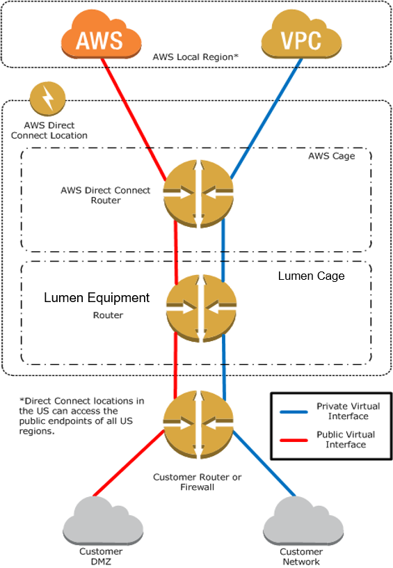

{{{
  "title": "Lumen Cloud Connect - What is ExpressRoute",
  "date": "06-06-2021",
  "author": "Gavin Lai",
  "attachments": [
  {
    "file_name": "Sample CloudFormation template to create VPC with VPN connectivity",
    "url": "../attachments/vpn-vpc-cloudforamtion.zip",
    "type": "application/zip"
  }
  ],
  "contentIsHTML": false,
  "sticky": true
}}}

### In this article:

* [Overview](#overview)
* [Audience](#audience)
* [Prerequistes](#prerequistes)
* [What is AWS Direct Connect](#what-is-aws-direct-coonect)
* [Lumen Cloud Connect for AWS Direct Connect](#lumen-cloud-connect-connectivity-options)
* [AWS Direct Connect resources](#azure-exporessroute-resrouces)
* [Support](#support)

### Overview
The purpose of this document is to provide an overview of Lumen Cloud Connect and AWS Direct Connect with references for further details.

### Audience

Users plan to order [Lumen Cloud Connect](../../Network/Cloud Connect/lumen-cloud-connect-introduction.md) to connect to their AWS environment.

### Prerequistes

None

### What is AWS Direct Connect
[AWS Direct Connect](//aws.amazon.com/directconnect/) links your internal network to an AWS Direct Connect location.
One end of the connection is connected to your network, the other to an AWS Direct Connect router.
With this connection in place, you can create virtual interfaces directly to the AWS cloud services, bypassing the public Internet.
An AWS Direct Connect location provides access to Amazon Web Services in the region it is associated with, as well as access to other US regions.
For example, you can provision a single connection to any AWS Direct Connect location in the US and use it to access public AWS services in all US Regions.
There are two connetion options available for Direct Connect, dedicated and hosted.  Dedicated Connection is made through a 1 Gbps, 10 Gbps, or 100 Gbps Ethernet port dedicated to a single customer. Hosted Connections are sourced from an AWS Direct Connect Partner that have a network link between themselves and AWS.  For hosted connections, the possible values are 50 Mbps, 100 Mbps, 200 Mbps, 300 Mbps, 400 Mbps, 500 Mbps, 1 Gbps, 2 Gbps, 5 Gbps, and 10 Gbps. Note that only those AWS Direct Connect partners who have met specific requirements may create a 1 Gbps, 2 Gbps, 5 Gbps or 10 Gbps hosted connection.  Lumen can provide [Lumen Cloud Connect](//www.lumen.com/en-us/hybrid-it-cloud/cloud-connect.html) with different connection options and speed to AWS to meet your business needs.  

Please see the [Getting Started with AWS Direct Connect](https://aws.amazon.com/directconnect/getting-started/) for connection options.

### Lumen Cloud Connect for AWS Direct Connect

There are different connectivity options to connect to AWS, the current options are listed below:

**Cloud Provider**|**AWS**
-------------|-------------
**Connection Type**|**Direct Connect**
Wavelength (Layer 1)|:heavy_check_mark:
Ethernet (Layer 2)|:heavy_check_mark:
IP VPN (Layer 3)|:heavy_check_mark:
Dynamic Connections|:heavy_check_mark:

For On-Ramps locations, please refer to the [maps](//assets.lumen.com/is/content/Lumen/maps-cloud-connect-on-ramps?Creativeid=c3d38810-e03e-4fb5-bb94-fd6551ff7388).

To learn more on how Lumen Cloud Connect can connect your company to AWS, please visit the [Product page](//www.lumen.com/en-us/hybrid-it-cloud/cloud-connect.html) or consult with your account team.  

### AWS Direct Connection resources

**Reference**|Location
-------------|-------------
**Introduction**|https://aws.amazon.com/directconnect/
**Details**|http://docs.aws.amazon.com/directconnect/latest/UserGuide/Welcome.html
**VPC Endpoints**|http://docs.aws.amazon.com/AmazonVPC/latest/UserGuide/vpc-endpoints.html
**Pricing**|https://aws.amazon.com/directconnect/pricing/ There are different price rates for traffic to the local AWS region and remote AWS regions
**FAQ**|https://aws.amazon.com/directconnect/faqs/
**Getting started**|https://docs.aws.amazon.com/directconnect/latest/UserGuide/getting_started.html
**AWS Direct Connect Limits**|https://docs.aws.amazon.com/directconnect/latest/UserGuide/Welcome.html#directconnect_limits
**Notes**|A single Lumen Dedicated IP VPN/MPLS Cloud Connect service supports connectivity to a single virtual interface (VIF) / VPC or a single Direct Connect gateway. To support additional VIFs/VPCs/Direct Connect gateways, order additional Cloud Connect logical connections. For more information, contact your Lumen representative.

### Support

* For issues related to Lumen Cloud Connect Services, please open a Lumen Support ticket by visiting [customer support](//www.lumen.com/en-us/contact-us-support.html) or [through the Lumen Support website](//www.lumen.com/help/en-us/home.html).
