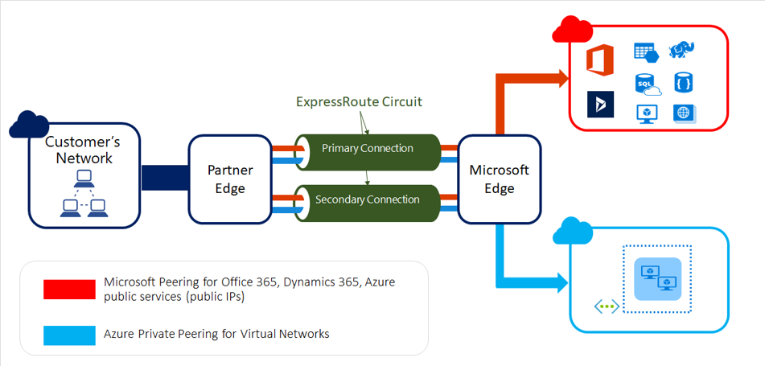

{{{
  "title": "Lumen Cloud Connect - What is ExpressRoute",
  "date": "06-06-2021",
  "author": "Gavin Lai",
  "attachments": [
  {
    "file_name": "Sample CloudFormation template to create VPC with VPN connectivity",
    "url": "../attachments/vpn-vpc-cloudforamtion.zip",
    "type": "application/zip"
  }
  ],
  "contentIsHTML": false,
  "sticky": true
}}}

### In this article:

* [Overview](#overview)
* [Audience](#audience)
* [Prerequistes](#prerequistes)
* [What is Azure ExpressRoute](#what-is-azure-expressroute)
* [Azure ExpressRoute Peering](#azure-expressoute-peering)
* [Lumen Cloud Connect Connectivity Options](#lumen-cloud-connect-connectivity-options)
* [Procedure to Configure Lumen Cloud Connect](#procedure-to-configure-lumen-cloud-connect)
* [Azure ExpressRoute resources](#azure-exporessroute-resrouces)
* [Support](#support)

### Overview
The purpose of this document is to provide an overview of Lumen Cloud Connect and Azure ExpressRoute with references for further details.

### Audience

Users plan to order [Lumen Cloud Connect](../../Network/Cloud Connect/lumen-cloud-connect-introduction.md) to connect to their Azure environment.

### Prerequistes

None

### What is ExpressRoute
[Microsoft Azure ExpressRoute](//azure.microsoft.com/en-us/documentation/articles/expressroute-introduction/) lets you create private connections between Microsoft datacenters and the infrastructure that’s in a co-location environment. ExpressRoute connections offer higher security, more reliability, faster speeds and predictable latencies than typical connections over the Internet. In some cases, using ExpressRoute connections to transfer data between your on-premises network and Azure can also yield significant cost benefits.
Azure offers circuit bandwidths from 50 Mbps to 10 Gbps (50Mbps, 100Mbps, 200 Mbps, 500 Mbps, 1 Gbps, 2 Gbps, 5Gbps, and 10 Gbps).
Azure compute services, namely virtual machines (IaaS) and virtual networks (VNets) deployed within a virtual network can be connected through the Azure Private Peering domain. 
PaaS Services such as Azure Storage, SQL databases and Web Apps are offered on public IP addresses. You can privately connect to services hosted on public IP addresses, including VIPs of your cloud services, through the Microsoft Peering routing domain. You can connect the Microsoft Peering domain to your extranet and connect to all Azure services on their public IP addresses from your WAN without having to connect through the Internet

### Azure ExpressRoute Peering

[Peering Comparison](//docs.microsoft.com/en-us/azure/expressroute/expressroute-circuit-peerings#peeringcompare)

  |**Private Peering**|**Microsoft Peering**
-------------|-------------|-------------
**Max. # prefixes supported per peering**|4000 by default, 10,000 with ExpressRoute Premium|200
**IP address ranges supported**|Any valid IP address within your WAN|Public IP addresses owned by you or your connectivity provider
**AS Number requirements**|Private and public AS numbers. You must own the public AS number if you choose to use one|Private and public AS numbers. However, you must prove ownership of public IP addresses
**IP protocols supported**|IPv4, IPv6 (preview)|IPv4, IPv6
**Routing Interface IP addresses**|RFC1918 and public IP addresses|Public IP addresses registered to you in routing registries
**MD5 Hash support**|Yes|Yes

Microsoft Peering now supports Azure Public (PaaS) services
* Microsoft has announced they are combining both their PaaS/SaaS services over a single pair of BGP Peers (Microsoft Peering)
* Before April 1, 2018, ExpressRoute had three peering connections:
  * Azure Private (IaaS) peering for connecting to Azure Vnets
  * Azure Public (PaaS) peering to reach Azure PaaS services
  * Microsoft Peering (SaaS) for Office 365 and Dynamics 365

* To simplify ExpressRoute management and configuration Microsoft has merged Azure Public routes into the Microsoft Peering connection
  * Customers can now access Azure PaaS and Microsoft SaaS services via the Microsoft peering connection
    * Customers no longer have to have 3 separate peering types to MSFT (Public / Private / MSFT Peering), but rather 2 peering types going forward (Private / MSFT Peering)
    * Refer to this [Microsoft document](//docs.microsoft.com/en-us/azure/expressroute/how-to-move-peering) to **move** Public peering to Microsoft peering.
* **Note**: While customers can receive all PaaS/SaaS services over MSFT Peering, the Office365 service still requires customers to apply for approval directly with Microsoft to enable the Office365 service via ExpressRoute.  All other services can be accessed via the MSFT Peering VLAN without a prior approval.
* Please reference to [Azure ExpressRoute for Office 365](//support.office.com/en-us/article/Azure-ExpressRoute-for-Office-365-6d2534a2-c19c-4a99-be5e-33a0cee5d3bd?ui=en-US&rs=en-US&ad=US) and [Network connectivity to Office 365](//support.office.com/en-us/article/Network-connectivity-to-Office-365-64b420ef-0218-48f6-8a34-74bb27633b10) for additional guidance and direction from Microsoft.

### Lumen Cloud Connect for Microsoft ExpressRoute

There are different connectivity options to connect to Microsoft Azure, the current options are listed below:

**Cloud Provider**|**Microsoft® Azure**
-------------|-------------
**Connection Type**|**ExpressRoute**
Wavelength (Layer 1)|
Ethernet (Layer 2)|:heavy_check_mark:
IP VPN (Layer 3)|:heavy_check_mark:
Dynamic Connections|:heavy_check_mark:

For On-Ramps locations, please refer to the [maps](//assets.lumen.com/is/content/Lumen/maps-cloud-connect-on-ramps?Creativeid=c3d38810-e03e-4fb5-bb94-fd6551ff7388).

To learn more on how Lumen Cloud Connect can connect your company to Microsoft Azure, please visit the [Product page](//www.lumen.com/en-us/hybrid-it-cloud/cloud-connect.html) or consult with your account team.  

### Azure ExpressRoute resources

**Reference**|Location
-------------|-------------
**Introduction**|https://azure.microsoft.com/en-us/documentation/articles/expressroute-introduction/
**FAQ**|https://azure.microsoft.com/en-us/documentation/articles/expressroute-faqs/
**Pricing**|http://azure.microsoft.com/pricing/details/expressroute/ Use Exchange Provider Pricing, There is a Premium if you need >4k routes or ability to reach other global regions
**Prerequisites**|https://azure.microsoft.com/en-us/documentation/articles/expressroute-prerequisites
**Circuits and routing domains**|https://azure.microsoft.com/en-us/documentation/articles/expressroute-circuit-peerings/
**Partners and peering locations**|https://azure.microsoft.com/en-us/documentation/articles/expressroute-locations/ 
**Azure Regions**|http://azure.microsoft.com/en-us/regions/
**Designing materials**|https://azure.microsoft.com/en-us/documentation/articles/expressroute-routing/; https://azure.microsoft.com/en-us/documentation/articles/expressroute-nat/
**Configuration materials**|https://docs.microsoft.com/en-us/azure/expressroute/expressroute-howto-circuit-portal-resource-manager
**Diversity**|Single port includes diversity from IQ+ edge to Microsoft
 |PE/Path diversity available by ordering 2 IQ ports which would require only a single Express Route Subscription
 |Full diversity achieved by ordering at 2 separate locations which would require multiple Express Route Subscriptions
**Notes**| Azure Datacenter Public IP Blocks: http://www.microsoft.com/en-us/download/details.aspx?id=41653
 |Dynamic routing via BGP
 |Azure Compute supports bring your own private IP

### Support

* For issues related to Lumen Cloud Connect Services, please open a Lumen Support ticket by visiting [customer support](//www.lumen.com/en-us/contact-us-support.html) or [through the Lumen Support website](//www.lumen.com/help/en-us/home.html).
