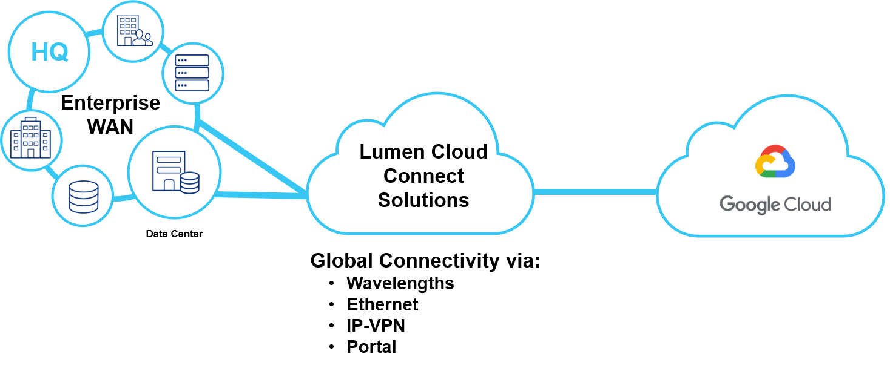
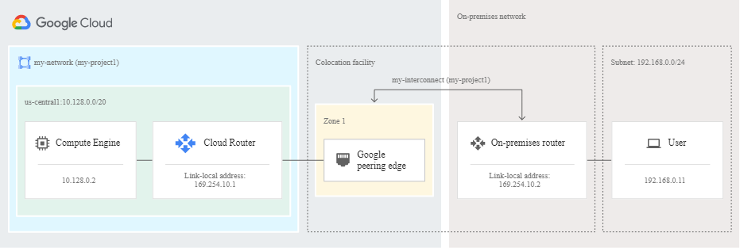
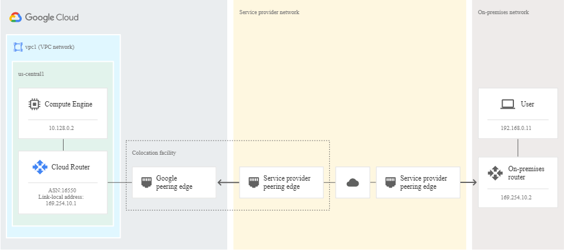

{{{
  "title": "Lumen Cloud Connect - What is GCP Interconnect",
  "date": "06-06-2021",
  "author": "Gavin Lai",
  "attachments": [
  ],
  "contentIsHTML": false,
  "sticky": true
}}}

### In this article:

* [Overview](#overview)
* [Audience](#audience)
* [Prerequisites](#prerequisites)
* [What is Google Cloud Platform Interconnect](#what-is-google-cloud-platform-interconnect)
* [Lumen Cloud Connect for Google Cloud Platform Interconnect](#lumen-cloud-for-google-cloud-platform-interconnect)
* [Google Cloud Platform Interconnect resources](google-cloud-platform-interconnect-resrouces)
* [Support](#support)

### Overview
The purpose of this document is to provide an overview of Lumen Cloud Connect and Google Cloud Platform (GCP) Interconnect with references for further details.

### Audience

Users plan to order [Lumen Cloud Connect](../../Network/Cloud Connect/lumen-cloud-connect-introduction.md) to connect to their Google Cloud Platform (GCP).

### Prerequisites

None

### What is Google Cloud Platform Interconnect
[Google Cloud Platform Interconnect](//cloud.google.com/network-connectivity/docs/interconnect) extends your on-premises network to Google's network through a highly available, low latency connection. You can use Dedicated Interconnect to connect directly to Google or use Partner Interconnect to connect to Google through a supported service provider.

Please see the [GCP Interconnect Overview](//cloud.google.com/network-connectivity/docs/interconnect/concepts/overview) for latest updates.  There are two connection options to connect to GCP, they are [Dedicated Interconnect](//cloud.google.com/network-connectivity/docs/interconnect/how-to#managing-dedicated-interconnect) and [Partner Interconnect](https://cloud.google.com/network-connectivity/docs/interconnect/how-to#managing-partner).  Lumen Cloud Connect service can provide both options and support SLA based solution.  Below are the high level description when using Lumen Cloud Connect:
* Dedicated interconnect
  For Dedicated Interconnect, you provision a Dedicated Interconnect connection between the Google network and your on-premises network using Lumen Cloud Connect.  
  
* Partner Interconnect
  Lumen has existing physical connections to Google Cloud Platform's network that they make available for their customers to use. You can request Lumen Cloud Connect to a GCP Partner Interconnect from Lumen. After Lumen provisions your connection, you can start passing traffic between your networks by using Lumen Cloud Connect.
  

* Solution with 99.99% GCP SLA
  * At least four Interconnect connections, two connections in one metropolitan area (metro) and two connections in another metro. Interconnect connections that are in the same metro must be placed in different edge availability domains (metro availability zones).
  * At least two Cloud Routers, one placed in each Google Cloud region. Even if you only have virtual machine (VM) instances in a single region, you must use two regions. If a region-wide issue occurs, Google Cloud can reroute traffic through the other region to your VMs. Each Cloud Router must be attached to a pair of Interconnect connections in a metro (two VLAN attachments for each Cloud Router).  
  * Example can be found at [GCP interconnect Overview](//cloud.google.com/network-connectivity/docs/interconnect/tutorials/dedicated-creating-9999-availability).
* Solution with 99.9% GCP SLA
  * At least two Interconnect connections. The connections must be located in the same metropolitan area (metro), but in different edge availability domains (metro availability zones). It doesn't matter if the connections are in the same facility or in different facilities, as long as they are located in two different edge availability domains.
  * At least one Cloud Router. Each Interconnect connection must be attached to the Cloud Router.
  * Example can be found at [GCP interconnect Overview](//cloud.google.com/network-connectivity/docs/interconnect/tutorials/dedicated-creating-999-availability)

### Lumen Cloud Connect for Google Cloud Platform Interconnect

There are different connectivity options to connect to OCI, the current options are listed below:

**Cloud Provider**|**Google Cloud Platform**
-------------|-------------
**Connection Type**|**FastConnect_Overview**
Wavelength (Layer 1)|:heavy_check_mark:
Ethernet (Layer 2)|:heavy_check_mark:
MPLS/IP VPN (Layer 3)|:heavy_check_mark:
Dynamic Connections|:heavy_check_mark:

For On-Ramps locations, please refer to the [maps](//assets.lumen.com/is/content/Lumen/maps-cloud-connect-on-ramps?Creativeid=c3d38810-e03e-4fb5-bb94-fd6551ff7388).

To learn more on how Lumen Cloud Connect can connect your company to Oracle Cloud Infrastructure, please visit the [Product page](//www.lumen.com/en-us/hybrid-it-cloud/cloud-connect.html) or consult with your account team.  

### Google Cloud Platform Interconnect resources

**Reference**|Location
-------------|-------------
**Cloud Interconnect Comparison"**|https://cloud.google.com/network-connectivity/docs/how-to/choose-product#cloud-interconnect
**GCP Interconnect Overview**|https://cloud.google.com/network-connectivity/docs/interconnect
**Google Cloud Platform Interconnect pricing**|https://cloud.google.com/hybrid-connectivity#cloud-interconnect-pricing
**GCP Dedicated Interconnect Overview**|https://cloud.google.com/network-connectivity/docs/interconnect/concepts/dedicated-overview
**GCP Partner Interconnect Overview**|https://cloud.google.com/network-connectivity/docs/interconnect/concepts/partner-overview
**GCP Interconnect Support**|https://cloud.google.com/network-connectivity/docs/interconnect/support

### Support

* For issues related to Lumen Cloud Connect Services, please open a Lumen Support ticket by visiting [customer support](//www.lumen.com/en-us/contact-us-support.html) or [through the Lumen Support website](//www.lumen.com/help/en-us/home.html).
