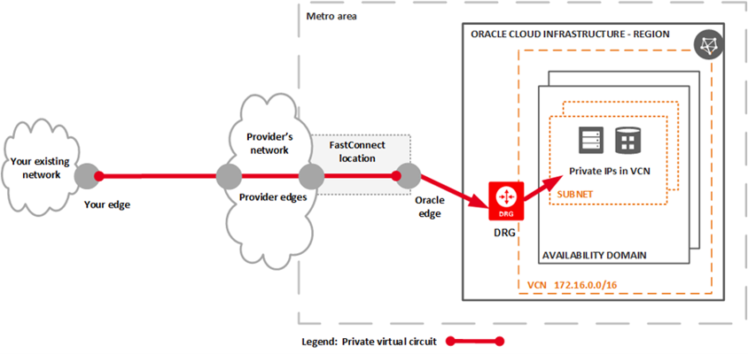
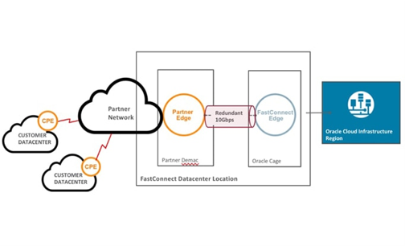
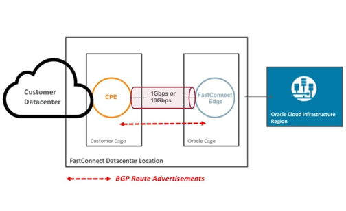
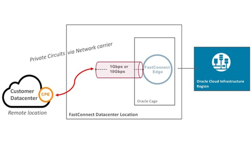
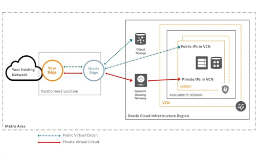

{{{
  "title": "Lumen Cloud Connect - What is Oracle FastConnect",
  "date": "06-06-2021",
  "author": "Gavin Lai",
  "attachments": [
  ],
  "contentIsHTML": false,
  "sticky": true
}}}

### In this article:

* [Overview](#overview)
* [Audience](#audience)
* [Prerequisites](#prerequisites)
* [What is Oracle FastConnect](#what-is-oracle-fastcoonect)
* [Lumen Cloud Connect for Oracle FastConnect](#lumen-cloud-for-oracle-fastconnect)
* [Oracle FastConnect resources](oracle-fastconnect-resrouces)
* [Support](#support)

### Overview
The purpose of this document is to provide an overview of Lumen Cloud Connect and Oracle FastConnect with references for further details.

### Audience

Users plan to order [Lumen Cloud Connect](../../Network/Cloud Connect/lumen-cloud-connect-introduction.md) to connect to their Oracle Cloud Infrastructure (OCI).

### Prerequisites

None

### What is Oracle Fast Connect
[Oracle Fast Connect](//www.oracle.com/cloud/networking/fastconnect/) is a network connectivity alternative to using the public internet for connecting your network with Oracle Cloud Infrastructure and other Oracle Cloud services.  FastConnect provides an easy, elastic, and economical way to create a dedicated and private connection with higher bandwidth options, and a more reliable and consistent networking experience when compared to internet-based connections.
Use Oracle FastConnect to extend your existing private networks to Oracle Cloud Infrastructure, via provider networks.

Please see the [Oracle FastConnect overview](//docs.oracle.com/en-us/iaas/Content/Network/Concepts/fastconnectoverview.htm#FastConnect_Overview) for latest updates.  There are different connection options to connect to OCI, detail guide is located [here](//www.oracle.com/cloud/networking/fastconnect-connectivity-models.html).  Below are the high level description:
* FastConnect: With an Oracle Provider
  
* FastConnect: Colocation with Oracle
  
* FastConnect: With a Third-Party Provider
  

There are two peering options in OCI, FastConnect Private and Public Peering, see below:
  

### Lumen Cloud Connect for Oracle Cloud Infrastructure FastConnect

There are different connectivity options to connect to OCI, the current options are listed below:

**Cloud Provider**|**Oracle Cloud Infrastructure**
-------------|-------------
**Connection Type**|**FastConnect_Overview**
Wavelength (Layer 1)|:heavy_check_mark:
Ethernet (Layer 2)|:heavy_check_mark:
MPLS/IP VPN (Layer 3)|
Dynamic Connections|:heavy_check_mark:

For On-Ramps locations, please refer to the [maps](//assets.lumen.com/is/content/Lumen/maps-cloud-connect-on-ramps?Creativeid=c3d38810-e03e-4fb5-bb94-fd6551ff7388).

To learn more on how Lumen Cloud Connect can connect your company to Oracle Cloud Infrastructure, please visit the [Product page](//www.lumen.com/en-us/hybrid-it-cloud/cloud-connect.html) or consult with your account team.  

### Oracle Cloud Infrastructure FasConnect resources

**Reference**|Location
-------------|-------------
**FastConnect with an Oracle provider information and "how to"**|https://docs.cloud.oracle.com/iaas/Content/Network/Concepts/fastconnectprovider.htm
**Oracle FastConnect network providers**|https://www.oracle.com/cloud/networking/fastconnect-providers.html
**FastConnect pricing**|https://cloud.oracle.com/en_US/fastconnect/pricing
**Oracle Cloud Infrastructure FastConnect FAQ**|https://www.oracle.com/cloud/networking/fastconnect-faq.html
**FastConnect documentation**|https://docs.cloud.oracle.com/iaas/Content/Network/Concepts/fastconnect.htm
**Oracle OCI support contacts**|OCI NOC Direct: 512-712-7403, cloud_noc_us_grp@oracle.com
 |OCI FastConnect Support: bmc_fastconnect_admins_us_grp@oracle.com

### Support

* For issues related to Lumen Cloud Connect Services, please open a Lumen Support ticket by visiting [customer support](//www.lumen.com/en-us/contact-us-support.html) or [through the Lumen Support website](//www.lumen.com/help/en-us/home.html).
